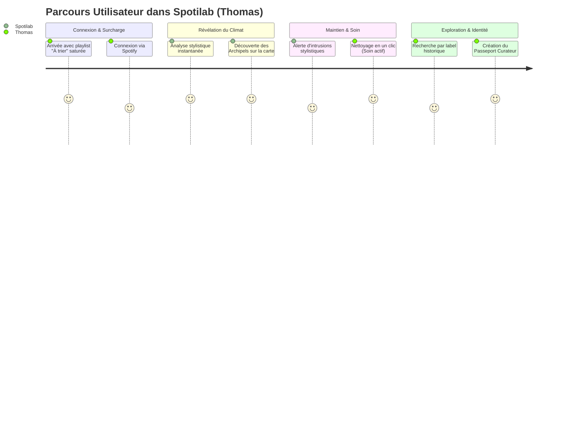

# Analyse des Genres & Parcours Utilisateur dans Spotilab

Ce document présente une étude approfondie de l'intégration d'une **analyse fine des genres musicaux** dans Spotilab, en s'appuyant sur des bases de données ouvertes (MusicBrainz, Last.fm, Wikidata) pour enrichir l'expérience utilisateur. Il décrit les nouveaux usages possibles et scénarise l'expérience à travers un **User Journey** complet et intégré à la philosophie de l'application.

---

## 1. Pourquoi l'analyse des genres sur Spotify est insuffisante

Actuellement, l'analyse des genres sur les plateformes de streaming classiques souffre de limites majeures :
* **Pas de genre à la chanson (Track) :** Spotify attribue des genres uniquement aux *Artistes*. Si un artiste pop produit un morceau de techno expérimentale pour un projet secondaire, ce morceau sera classé comme "Pop" par défaut.
* **Le "bruit" des étiquettes (Genre Flooding) :** Les artistes Spotify se voient attribuer des dizaines de genres flous par les algorithmes de catégorisation commerciale (ex: `indie rock`, `modern rock`, `garage rock`, `post-punk revival`).
* **Absence de généalogie historique :** Il n'y a pas de lien logique entre les styles (ex: savoir que le *Post-Punk* est le parent direct de la *Coldwave* ou du *Goth Rock*).

### L'apport des bases collaboratives (MusicBrainz / Last.fm)
En se branchant sur MusicBrainz et Last.fm, Spotilab peut accéder à des **tags communautaires posés directement sur les enregistrements (Recordings)**. Cela permet de définir un **Climat Stylistique** précis, ancré dans l'histoire de la musique et validé par l'expérience humaine plutôt que par des calculs statistiques opaques.

---

## 2. Nouveaux Usages Activés par l'Analyse des Genres

En résonance avec les concepts de votre mémoire (*Lestage*, *Climat*, *Soin & Maintenance*), voici ce que permettrait cette intégration :

```
                  +-----------------------------------+
                  |      Analyse des Genres Fins      |
                  +-----------------------------------+
                                    |
       +----------------------------+----------------------------+
       |                            |                            |
       v                            v                            v
+--------------+             +--------------+             +--------------+
| Le Climat    |             | Le Lestage   |             | Soin et      |
| Stylistique  |             | par Archipels|             | Maintenance  |
+--------------+             +--------------+             +--------------+
| Cartographie |             | Regroupement |             | Détection et |
| sémantique & |             | spatial par  |             | nettoyage    |
| historique.  |             | styles (2D). |             | d'intrus.    |
+--------------+             +--------------+             +--------------+
```

### A. Le Climat Stylistique & La Granularité Adaptative
Plutôt que de résumer l'atmosphère d'une playlist par des chiffres abstraits (*"Énergie : 0.65"*), Spotilab dresse un portrait culturel. Pour éviter l'écueil de genres trop complexes ou trop confidentiels (niche), l'application implémente un **"Zoom Stylistique" (Taxonomie & Arbre des genres)** :

* **La Granularité Adaptative :** L'utilisateur dispose d'un curseur interactif permettant de faire varier le niveau de précision des genres affichés :
  * **Niveau 1 - Macro (Catégories Générales) :** Les genres de niche remontent vers leurs super-catégories universelles parlantes pour le grand public (ex: *Rock, Pop, Électronique, Hip-Hop, Jazz*). C'est le niveau idéal pour une présentation grand public (ex: *100% Rock / Alternative*).
  * **Niveau 2 - Méso (Branches intermédiaires) :** Des styles majeurs identifiables (ex: *Alternative Rock, Synthpop, House, Trap*).
  * **Niveau 3 - Micro (Niche / Expertise) :** Les genres précis issus de la communauté (ex: *Shoegaze, Dream Pop, Coldwave, Emo Rap*). Ce niveau s'adresse au curateur expert soucieux du détail de son catalogue.
* **Le radar sémantique dynamique :** Le graphique de répartition s'ajuste instantanément. Les sous-genres sont cumulés et "propagés" vers leurs nœuds parents en remontant l'arbre taxonomique (modélisé localement ou via la propriété *subclass of* de Wikidata).
* **L'ambiance sémantique :** Extraction de tags d'humeur et d'attitudes culturelles associés aux familles de genres (ex: *nocturne, mélancolique, contestataire, contemplatif*).

### B. Le Lestage par "Archipels Stylistiques" (Visualisation intuitive)
Actuellement, la carte 2D de `CartographeMap` positionne les morceaux selon les axes Valence vs Énergie. 
* **Le problème :** Un morceau de Black Metal très rapide et une chanson de K-Pop survoltée peuvent se retrouver proches sur l'axe de l'énergie, créant une dissonance visuelle.
* **La solution :** Remplacer ces axes par une **analyse de proximité stylistique** (via un algorithme de réduction de dimensionnalité comme le MDS). La carte devient un ensemble d'**Archipels de Genres** (ex: *L'Île Ambient*, *La Côte Techno*, *La Vallée Folk*). L'utilisateur repère visuellement la géographie réelle de sa playlist. De même que le radar sémantique, la carte peut fusionner ou diviser les archipels en fonction du niveau de zoom stylistique sélectionné.

### C. Soin & Maintenance : Le Détecteur d'Intrusions Stylistiques
C'est la matérialisation de la lutte contre le "Diogène numérique" et la surcharge mentale d'une bibliothèque désordonnée :
* L'application analyse la cohérence stylistique d'une playlist.
* Elle identifie les **morbides anomalies de genre** (ex: un morceau de *Reggaeton* perdu au milieu d'une playlist *Doom Metal*).
* Elle propose des actions de maintenance concrètes : *"Ce morceau s'écarte de 85% du climat stylistique de votre playlist. Souhaitez-vous le déplacer dans votre boîte de tri ?"*

---

## 3. User Journey & User Experience (UX) Intégrée

Voici la scénarisation pas à pas du parcours de **Thomas**, un utilisateur mélomane souffrant de surcharge cognitive face à sa bibliothèque musicale.



### Étape 1 : Le Constat de l'Encombrement (Surcharge cognitive)
* **Le Contexte :** Thomas a une playlist intitulée *"À Trier"* contenant 350 titres accumulés au fil de ses découvertes hebdomadaires. Il n'écoute plus cette playlist car elle est devenue trop hétérogène (dissonante) et désorganisée. C'est l'illustration de l'**inhabitabilité** numérique.
* **L'Action :** Thomas se connecte sur Spotilab et soumet sa playlist *"À Trier"*.

### Étape 2 : La Révélation du Climat & des Archipels (Visualisation)
* **L'Expérience :** Thomas ne voit pas une simple liste. Il découvre un écran coloré néo-brutaliste qui lui annonce : 
  > *« Votre espace sonore est actuellement un climat tempéré de **Post-Punk (45%)** et de **Synthwave (30%)** avec quelques perturbations **Hip-Hop (10%)**... »*
* **L'Interaction (Le Zoom Stylistique) :** Thomas trouve la vue initiale un peu trop technique. D'un glissement de curseur sur le curseur de zoom stylistique, il passe du niveau **Micro** au niveau **Macro**. Instantanément, la répartition se regroupe et la carte s'épure : il voit maintenant que sa playlist est composée à *75% de Rock / Alternative*, *15% de Musique Électronique* et *10% de Rap*. Les îles de la carte fusionnent visuellement pour former deux grands continents et une petite péninsule. Cela lui permet de communiquer plus facilement sur ses goûts avec son entourage moins expert.
* **La Carte :** En repassant en mode plus détaillé, la carte 2D réaffiche ses archipels. Thomas clique sur *"L'Île Post-Punk"* pour voir ses morceaux s'illuminer. Il réalise visuellement la structure de sa bibliothèque. Le **lestage** (l'ancrage cognitif) fonctionne : la musique prend une forme géographique rassurante.

### Étape 3 : La Maintenance Active (Le moment de "Soin")
* **L'Action :** Thomas clique sur l'onglet **« Soin & Maintenance »** (symbolisé par un balai 🧹).
* **Le Signalement :** L'application met en évidence 4 morceaux exilés tout au bout de la carte, loin des îles principales :
  * Un titre de Variété française ajouté pour une soirée.
  * Deux morceaux de Trap américaine.
* **L'Interaction :** Spotilab lui propose : *« Voulez-vous nettoyer ces 4 intrus pour purifier le climat de votre playlist ? »*. Thomas clique sur **« Archiver les intrus »**. Les morceaux sont déplacés dans une nouvelle playlist de secours. Thomas ressent un soulagement immédiat : son espace d'écoute est redevenu habitable.

### Étape 4 : L'Exploration Hors-Algorithme (La découverte active)
* **L'Expérience :** Thomas souhaite enrichir sa sélection Post-Punk, mais il refuse les recommandations habituelles de Spotify qu'il juge répétitives (l'aliénation algorithmique).
* **La Tactique :** Via le panneau d'exploration sémantique de Spotilab, il clique sur le genre *Post-Punk* pour ouvrir une passerelle vers MusicBrainz. Il choisit d'explorer :
  * Les morceaux sortis entre **1979 et 1982** (âge d'or).
  * Publiés par le label indépendant **Factory Records**.
* **Le Résultat :** Il découvre des morceaux rares (que Spotify ne lui aurait jamais suggérés) et les ajoute directement à sa playlist purifiée.

### Étape 5 : L'Affichage du Passeport Curateur (Identité & Fierté)
* **L'Action :** Fier de son travail de tri, Thomas génère son **Passeport Curateur**.
* **La Fiche d'Identité :** Le passeport affiche :
  * Sa spécialité : *Archiviste Post-Punk / Coldwave*.
  * Son score de maintenance : *98%* (témoignant de la propreté de ses espaces).
  * Son indice d'obscurité : *Très élevé* (indiquant sa propension à dénicher des perles rares).
* **La Projection :** Thomas partage ce passeport avec ses amis, convertissant ses pratiques d'exploration expertes en valeur symbolique et sociale (le processus de distinction de Bourdieu revisité par la technique).
