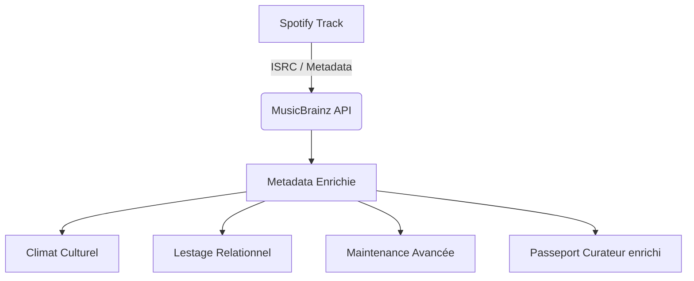

# Analyse de Spotilab & Potentiel d'intégration de l'API MusicBrainz

Ce document propose une analyse de l'application **Spotilab** (inspirée par le mémoire de recherche *« algo Rythm »* d'Alex Pellier sous la direction de Dominique Cardon) et explore les opportunités offertes par une intégration avec l'API ouverte **MusicBrainz**.

---

## 1. Analyse de l'application actuelle Spotilab

Spotilab est une application Next.js structurée autour de la base de données SQLite (via Prisma) et de l'API Spotify (avec un fallback vers ReccoBeats pour les caractéristiques audio).

### Concepts théoriques implémentés
L'application matérialise plusieurs concepts clés de l'**habitèle** (décrit dans le mémoire) appliqué à la musique :
1. **Le Climat Sonore (Filtrage & Ambiance) :** Représenté actuellement par la moyenne de la *Valence* (positivité émotionnelle) et de l'*Énergie* physique des morceaux d'une playlist.
2. **Le Lestage Visuel (Ancrage & Repères) :** Visualisé via `CartographeMap`, qui positionne les morceaux sur une carte 2D (Valence vs Énergie) pour aider l'utilisateur à se repérer spatialement dans ses habitudes.
3. **Soin & Maintenance (Lutte contre le Diogène numérique) :** Géré par `AnalysteUnidimensionnel`, qui identifie les morceaux dissonants ou excentrés dans les playlists pour inciter au tri et à la réorganisation.
4. **Passeport Curateur (Identité & Expertise) :** Un profil public (`/curator/[id]`) compilant les statistiques des playlists pour valoriser l'expertise de sélection de l'utilisateur.

### Limites techniques et conceptuelles actuelles
* **Dépendance exclusive aux critères physiques/acoustiques de Spotify :** Le "Climat" et le "Lestage" reposent sur des scores calculés par des algorithmes propriétaires (danseabilité, valence, énergie, etc.). Ces critères sont parfois froids, dénués de contexte culturel ou historique.
* **Manque de données contextuelles fines :** L'API Spotify fournit peu d'informations sur l'histoire des morceaux (qui a composé ? qui a produit ? où cela a-t-il été enregistré ? quel est le label ? quelle est la véritable date de sortie d'origine plutôt que celle de la réédition numérique ?).
* **Fermeture de l'écosystème Spotify :** Depuis fin 2024, Spotify a restreint l'accès à son API d'audio-features aux applications non validées, obligeant Spotilab à utiliser un fallback externe (ReccoBeats).

---

## 2. Le "Pont" Technique : Connecter Spotify à MusicBrainz

Pour exploiter MusicBrainz, il est indispensable de faire correspondre un morceau Spotify (`Track` dans Spotilab) à un enregistrement MusicBrainz. Heureusement, il existe des identifiants standards mondiaux qui servent de passerelle.

### A. La passerelle ISRC (International Standard Recording Code)
Chaque morceau sur Spotify possède un code unique ISRC. L'API Spotify le renvoie dans l'objet Track sous la clé `external_ids.isrc`.
MusicBrainz indexe massivement les ISRCs. On peut donc interroger MusicBrainz directement avec cet identifiant :

```http
GET https://musicbrainz.org/ws/2/recording/?query=isrc:FRUM71600123&fmt=json
```

Cette méthode évite le "fuzzy matching" (recherche textuelle par titre/artiste) qui est sujet aux erreurs de frappe ou d'homonymie.

### B. Gestion des contraintes de l'API MusicBrainz
L'API publique de MusicBrainz est gratuite mais impose des règles strictes :
* **Limitation du taux :** Maximum **1 requête par seconde** (rate limiting).
* **User-Agent obligatoire :** Un `User-Agent` clair et descriptif identifiant l'application (ex: `Spotilab/1.0.0 ( contact@example.com )`) est requis sous peine de bannissement.
* **Stratégie de cache (SQLite/Prisma) :** Il est impératif de stocker en base de données les résultats de MusicBrainz dès qu'ils sont récupérés pour éviter d'interroger l'API à chaque affichage.

---

## 3. Opportunités fonctionnelles : Enrichir les concepts de Spotilab

L'intégration de MusicBrainz permet de passer d'une analyse purement acoustique à une **analyse culturelle, historique et relationnelle**.



### Axe 1 : Le Climat Sonore & Temporel (Enrichi)
Actuellement basé sur des ondes physiques, le climat peut devenir **culturel et géographique** :
* **Cartographie géographique (Soundscape Origin) :** MusicBrainz stocke le pays et la ville d'origine des artistes. On peut ainsi calculer et afficher la géographie d'une playlist (ex: *« Cette playlist a un climat très ancré à Bristol (Trip-Hop) et à Reykjavik (Post-Rock) »*).
* **Climat Historique (Original Release Date) :** Spotify affiche souvent la date de l'album disponible en streaming (ex: une compilation de 2020 pour un morceau de 1970). MusicBrainz conserve la **date de première publication de l'enregistrement (Recording)**. Cela permet de dresser un véritable histogramme temporel de la playlist.
* **Genres Fins & Tags Communautaires :** MusicBrainz dispose d'un système de tags communautaires très dynamique (ex: `gothic rock`, `shoegaze`, `lo-fi`, `anti-war`). On peut ainsi cartographier le climat sémantique d'une playlist de manière beaucoup plus fine que les larges catégories de Spotify.

### Axe 2 : Le Lestage Relationnel (De nouveaux repères visuels)
Le lestage consiste à donner des repères pour "habiter" son espace d'écoute. Avec MusicBrainz, on peut proposer un **Lestage Relationnel sous forme de graphe** :
* **Le réseau des crédits :** MusicBrainz référence les relations entre artistes (qui a joué de la basse sur ce morceau ? qui l'a produit ? qui l'a composé ?). Spotilab pourrait afficher un graphe montrant comment les morceaux d'une playlist sont connectés dans l'ombre (ex: *« 4 morceaux de votre playlist ont été produits par Brian Eno, et 2 partagent le même batteur de session »*).
* **Les généalogies de groupes :** Identifier si des artistes de la playlist ont fait partie des mêmes formations précédentes (ex: repérer les liens entre Joy Division et New Order, ou les projets solos de membres de Radiohead).

### Axe 3 : Soin & Maintenance (Lutte contre les doublons cachés)
La maintenance vise à éviter le syndrome de Diogène numérique.
* **Détection des doublons réels (Same Recording) :** Une playlist contient parfois deux fois le même morceau issu d'albums différents (l'album studio et un "Best Of"). Spotify leur attribue des ID différents. Grâce à MusicBrainz, on peut détecter qu'ils partagent le même **Recording MBID** ou le même **ISRC**, et suggérer une fusion automatique.
* **Identification des versions (Live, Démo, Bootleg) :** MusicBrainz qualifie les versions (Live, Remix, Single Edit, Demo). L'application peut aider à nettoyer une playlist en isolant les morceaux "non-studio" pour préserver la cohérence du climat.

### Axe 4 : Le Passeport Curateur (Valoriser l'expertise culturelle)
Le passeport curateur peut devenir une véritable carte d'identité de chercheur musical :
* **L'Indice d'Obscurité/Niche :** En mesurant la popularité d'une œuvre sur MusicBrainz (nombre de notations, nombre de releases physiques existantes), on peut calculer un score d'expertise/niche beaucoup plus fiable que le simple "popularité" Spotify (souvent biaisé par les écoutes de masse récentes).
* **Labels Discographiques Indépendants :** Valoriser les labels sur lesquels le curateur s'appuie (ex: *« Expert du label Factory Records ou Warp »*).

---

## 4. Propositions de modification du Modèle de Données (Prisma)

Pour soutenir ces fonctionnalités, voici comment le schéma `schema.prisma` pourrait évoluer pour intégrer les données de MusicBrainz :

```prisma
// Extension du modèle Track pour accueillir les métadonnées de MusicBrainz
model Track {
  id               String          @id // Spotify ID
  name             String
  artists          String          
  albumName        String
  albumImageUrl    String?
  durationMs       Int
  previewUrl       String?
  
  // Champs existants (Spotify)
  danceability     Float?
  energy           Float?
  key              Int?
  loudness         Float?
  mode             Int?
  speechiness      Float?
  acousticness     Float?
  instrumentalness Float?
  liveness         Float?
  valence          Float?
  tempo            Float?
  
  // NOUVEAUX CHAMPS (MusicBrainz)
  isrc             String?         @unique // Code ISRC
  mbid             String?         // MusicBrainz Recording ID
  originalYear     Int?            // Vraie année de première sortie
  artistOrigin     String?         // Pays/Ville d'origine de l'artiste principal
  tags             String?         // Tags communautaires stockés en JSON (ex: ["post-punk", "80s"])
  label            String?         // Premier label d'édition
  
  createdAt        DateTime        @default(now())
  playlists        PlaylistTrack[]
}
```

---

## 5. Idées d'écrans & Maquettes Fonctionnelles pour l'intégration

### Écran A : Le Climat Sémantique et Géographique (complétant la carte 2D)
* **Composant :** Une carte du monde interactive affichant la provenance des morceaux. Un survol de l'Islande montre les artistes écoutés là-bas (Sigur Rós, Björk).
* **Bénéfice Utilisateur :** Un sentiment de voyage et de spatialisation géographique de ses habitudes d'écoute.

### Écran B : Le Réseau du Lestage (Visualisation de graphe)
* **Composant :** Un canvas interactif (utilisant par exemple D3.js ou vis.js) reliant les artistes de la playlist par leurs collaborateurs, compositeurs ou producteurs communs.
* **Bénéfice Utilisateur :** Rendre visible l'infrastructure humaine et historique derrière la musique, renforçant l'attachement cognitif décrit dans le mémoire.

### Écran C : L'outil de Triage et Fusion (Soin)
* **Composant :** Un tableau listant les doublons d'enregistrement (ex: *« Nous avons détecté "Heroes" (1977) en double dans votre playlist : version album et version compilation. Souhaitez-vous ne garder que la version originale ?" »*).
* **Bénéfice Utilisateur :** Réduire l'encombrement et automatiser le maintien difficile de la bibliothèque.
